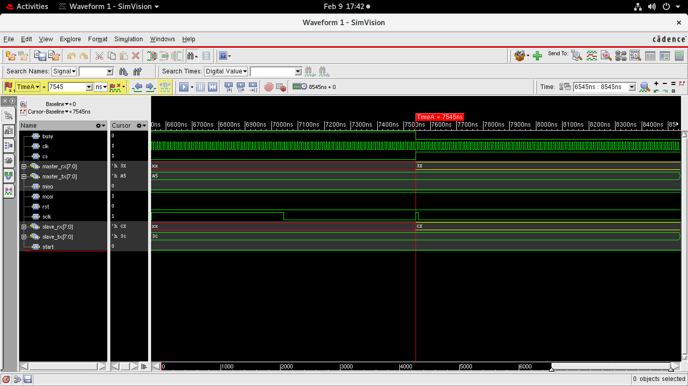

# UART Communication Protocol Implementation (Verilog)

## 📌 Overview
This project implements the Universal Asynchronous Receiver Transmitter (UART) protocol using Verilog HDL.  
The design includes UART Transmitter, UART Receiver, Baud Rate Generator, and Top module integration.

This work is developed as part of FuSa (Functional Safety) Internship learning.

---

## 📖 What is UART?

UART (Universal Asynchronous Receiver Transmitter) is a serial communication protocol used for full-duplex communication between devices.

### Key Features:
- Asynchronous communication (No clock sharing)
- Start and Stop bits
- Optional parity
- Configurable baud rate

---

## 🏗️ Project Structure

---

## 🔧 Modules Description

### 1️⃣ UART Transmitter (uart_tx.v)
- Converts parallel data into serial format
- Adds Start bit and Stop bit
- Transmits data at configured baud rate

### 2️⃣ UART Receiver (uart_rx.v)
- Detects start bit
- Samples incoming serial data
- Reconstructs parallel data

### 3️⃣ Baud Generator (baud_generator.v)
- Generates baud clock from system clock
- Controls transmission speed

### 4️⃣ Top Module (uart_top.v)
- Integrates TX and RX
- Connects baud generator

---

## 📊 Simulation

Simulation performed using:
- Xcelium / ModelSim (mention what you used)
- Testbench verifies:
  - Start bit detection
  - Data transmission
  - Stop bit validation
  - RX correctness

---

## 📷 Waveform Output

---

## 🎯 Learning Outcomes

- Serial communication protocol understanding
- FSM-based UART design
- Clock division for baud rate generation
- Testbench writing and verification

---

## 🚀 Future Improvements

- Add parity support
- Configurable data width
- FIFO integration
- Error detection

---

## 👨‍💻 Author

Vinayak Todakar  
B.E. Final Year  
KLE Technological University  

